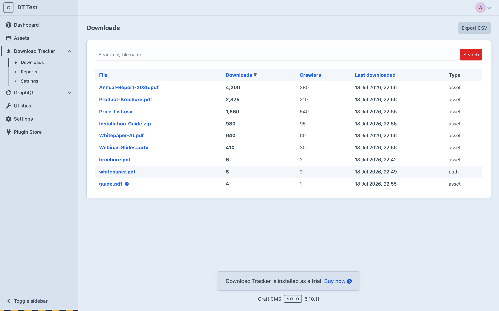
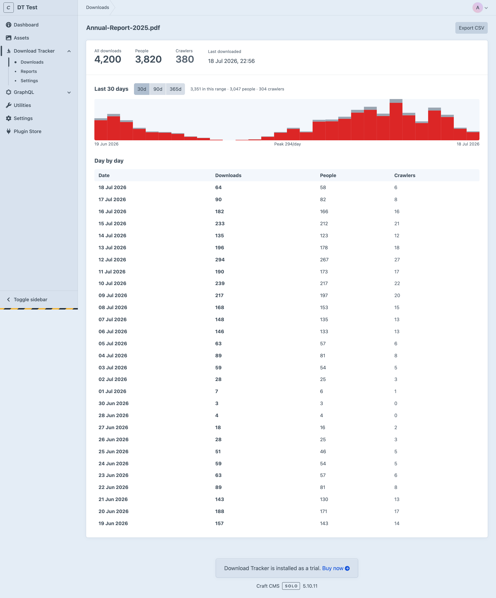

# Download Tracker for Craft CMS

Count how many times each of your files gets downloaded - without bloating your
database.

A lot of the download-tracking tools I found wrote a new database row (or even a whole element)
for **every single download**. On a busy site that table balloons into millions
of rows and starts to hurt, I found that sites that had static caching enabled were
refreshing the cache constantly. Download Tracker takes the opposite approach: it
keeps **one running counter per file** and increments it atomically. A file
downloaded a million times is still a single row.

It's also built for modern, cache-first Craft sites. If you run full-page static
caching such as [Blitz](https://putyourlightson.com/plugins/blitz), you'll know
that a cached page never touches PHP - so anything that tries to "count on page
load" simply never fires. Download Tracker sidesteps this entirely by counting
on a lightweight background request that static caches always let through.

## Features

- **One counter per file.** Atomic `count + 1` updates mean no per-download row
  explosion and no race conditions, even under heavy concurrent traffic.
- **Daily breakdown.** A compact per-day rollup (one row per file per day) lets
  you see trends over time, and old rows are pruned automatically. Every file has
  a detail screen with its day-by-day chart, table and CSV export.
- **People and crawlers, told apart.** Count crawler downloads separately from
  human ones, ignore them, or block them outright with a 403.
- **Works with static caching.** Counting happens on a background request, so it
  keeps working on pages served straight from a Blitz (or similar) cache.
- **Zero-touch setup.** Turn it on and it starts counting your existing download
  links automatically - no template changes required.
- **Optional managed download links** for gated, private, remote, or
  force-“Save as…” downloads, using a signed, tamper-proof URL.
- **Reporting built in.** A searchable, sortable Downloads screen in the control
  panel, CSV export, saved reports, and a “Top Downloads” dashboard widget.
- **Coming from Link Vault?** Bring your download history with you - totals and
  daily history import into the counters before you uninstall it. See
  [Moving from Link Vault](#moving-from-link-vault).

## Screenshots

The **Downloads** screen — every tracked file, its running total, the crawler
share, and when it was last pulled, searchable and sortable, with CSV export:



Each file has a **detail screen** with its people-vs-crawler totals and a
day-by-day chart over the last 30, 90 or 365 days:



## Documentation

Full documentation lives at
[coysh.digital/plugins/download-tracker/docs](https://coysh.digital/plugins/download-tracker/docs/).
This README is the short version; the docs go deeper on installation, click
tracking, managed links, crawlers, the Twig API, reporting, settings and the
Link Vault import.

## Requirements

- Craft CMS 5.0 or later
- PHP 8.2 or later

This is the Craft 5 release. If you're still on **Craft 4**, use the
[`craft-4-support`](https://github.com/Coysh-Digital/craft-download-tracker/tree/craft-4-support)
branch, which runs on Craft 4 and Craft 5 alike. It's handy if you want to import
your Link Vault history and drop Link Vault before upgrading to Craft 5, rather
than carrying it through the upgrade.

## Installation

Install with Composer and then enable the plugin:

```bash
composer require coysh-digital/craft-download-tracker
php craft plugin/install download-tracker
```

Or install it from the **Plugin Store** in your control panel.

## How it works

Downloads are counted through one of two routes, and both update the same
counter - so a file is never double-counted.

### 1. Automatic click tracking (the default)

With **Auto-track download links** switched on, the plugin adds a tiny script to
your front-end pages. When a visitor clicks something that looks like a download
- a link under one of your configured paths, a link to a tracked file type, or
any link with a `download` attribute - the script quietly pings the plugin and
then lets the browser download the file exactly as it normally would.

You don't have to change any of your templates or links. To exclude a specific
link, add `data-dt-ignore` to it.

### 2. Managed download links (optional)

When you want a download counted reliably on the server - for example a
members-only PDF, a file on private/off-server storage, or a link that should
force a “Save as…” - route it through the plugin:

```twig
<a href="{{ craft.downloadTracker.url(entry.brochure.one()) }}">
  Download the brochure
</a>
```

The link carries a signed token, counts the download when clicked, and then
either redirects to the file (for public assets) or streams it through Craft
(for private or off-server assets).

### Crawlers

Search engines, AI crawlers, link unfurlers and uptime monitors all download
files, and left alone they quietly inflate your numbers. **Crawler downloads**
in the settings decides what happens to them:

- **Count separately** (the default) keeps them visible without letting them
  pollute your human figures. The total counts everything, and the crawler
  figure beside it tells you how much of that wasn't a person.
- **Don't count** serves the file and records nothing.
- **Block with a 403** refuses the download on managed links, so nothing is
  streamed. This only applies to managed links - the click beacon has no file to
  withhold, so it simply doesn't count the hit. Worth knowing before you switch
  it on: blocking trusts the detection completely, and a User-Agent that's
  wrongly read as a crawler means a real person meets a 403. Counting separately
  is the safer default because a miscount is something you can see and correct;
  a refused download just looks broken.

Browser prefetch and prerender requests are always served and never counted,
whichever you choose - a prefetch is a real browser getting ready for a real
click, so it's neither a crawler to turn away nor a download to count.

The plugin knows the well-known crawlers by name and catches most of the rest by
their User-Agent; **Extra crawler user agents** takes anything else you spot in
your own logs. It deliberately doesn't record *which* crawler made a download:
that would mean a row per file per crawler per day, which is exactly the row
growth this plugin exists to avoid.

> **A note on private files:** a download link is a bearer link - anyone who has
> the URL can use it. If you place a managed link to a *private* asset on a
> *publicly cached* page, that URL gets baked into the cached HTML and becomes a
> permanent public link. For genuinely private files, turn on **Require login**,
> and/or set a **Signed URL lifetime** and only render the link on pages that
> aren't statically cached (such as logged-in account pages).

## Reading the numbers in Twig

```twig
{{ craft.downloadTracker.total(asset) }}         {# all downloads, people and crawlers #}
{{ craft.downloadTracker.userTotal(asset) }}     {# people only #}
{{ craft.downloadTracker.crawlerTotal(asset) }}  {# crawlers only #}
{{ craft.downloadTracker.daily(asset, 30) }}     {# day-by-day history #}
{{ craft.downloadTracker.record(asset) }}        {# the counter record, incl. last download #}
{{ craft.downloadTracker.top(10) }}              {# the ten most-downloaded files #}
{{ craft.downloadTracker.url(asset) }}           {# a signed, counting download link #}
```

All of these accept an Asset, an asset ID, or a URL/path string — except `url()`,
which takes an Asset.

`daily()` returns one entry per day, oldest first, with days that saw no
downloads included as zeroes, so you can chart it without minding the gaps:

```twig

  {{ day.date }}: {{ day.count }} ({{ day.userCount }} people, {{ day.crawlerCount }} crawlers)

```

> **Tip:** avoid printing a live download count directly into a statically
> cached page - the number would freeze until the cache is regenerated. Show
> counts in the control panel, or load them with a small client-side request.

## Settings

Everything is configurable in **Settings → Download Tracker**, or in a
`config/download-tracker.php` file (which takes precedence, and is handy for
per-environment values):

| Setting | What it does |
| --- | --- |
| Auto-track download links | Injects the click-tracking script on the front end. |
| Tracked path prefixes | URL paths whose links should be counted, e.g. `/assets/files/`. |
| Tracked extensions | File types to treat as downloads (`pdf`, `zip`, `csv`, …). |
| Track download-attribute links | Also count any link with a `download` attribute. |
| Excluded hosts | Hostnames to ignore, e.g. an image CDN. |
| Track non-asset files | Also count links that don't resolve to a Craft asset. Off by default. |
| Crawler downloads | Count crawlers separately, don't count them, or block them with a 403. |
| Extra crawler user agents | Extra User-Agent tokens to treat as crawlers, on top of the built-in list. |
| Serve mode | How managed links deliver files: redirect, stream, or auto. |
| Force download | Serve managed downloads as an attachment (“Save as…”). |
| Require login | Only serve managed downloads to logged-in users. |
| Signed URL lifetime | How long a managed download link stays valid (0 = forever). |
| Daily rollup retention | How many days of per-day history to keep. |

## Moving from Link Vault

If you're coming from [Link Vault](https://github.com/masugadesign/link-vault-craft-cms),
your download history can come with you. Link Vault keeps a row per download;
this plugin keeps a count per file, and the importer folds one into the other.

**Do this before you uninstall Link Vault.** The importer reads Link Vault's
tables directly, so the history is gone once they are. Link Vault isn't modified
or removed - you can import, check the numbers, and only then uninstall it.

With both plugins installed, go to **Download Tracker → Import** (admins only;
the page only exists while Link Vault does). It shows what it will do before you
commit to anything, then runs in the background - progress appears in the control
panel's queue indicator. For a very large history you may prefer the console:

```sh
php craft download-tracker/import/link-vault --dryRun   # report, change nothing
php craft download-tracker/import/link-vault            # do it
```

It's safe to run more than once: it resumes rather than counting anything twice.
So you can import, leave Link Vault running a little longer, and run it again to
pick up the stragglers before uninstalling.

Kept: each file's running total, its last-downloaded date, and its day-by-day
history (as far back as your **Daily rollup retention** allows - set it to `0`
before importing to keep the lot). Not kept: who downloaded what and from which
IP, custom fields, and the people/crawler split, since Link Vault never recorded
a user agent. See the
[Link Vault import docs](https://coysh.digital/plugins/download-tracker/docs/link-vault-import)
for the full detail.

## Support

Found a bug or have a request? Please open an issue on
[GitHub](https://github.com/Coysh-Digital/craft-download-tracker/issues).

## License

This plugin is commercial software, released under a commercial license. See
[LICENSE.md](LICENSE.md) for details.

Made by [Coysh Digital](https://coysh.digital).
